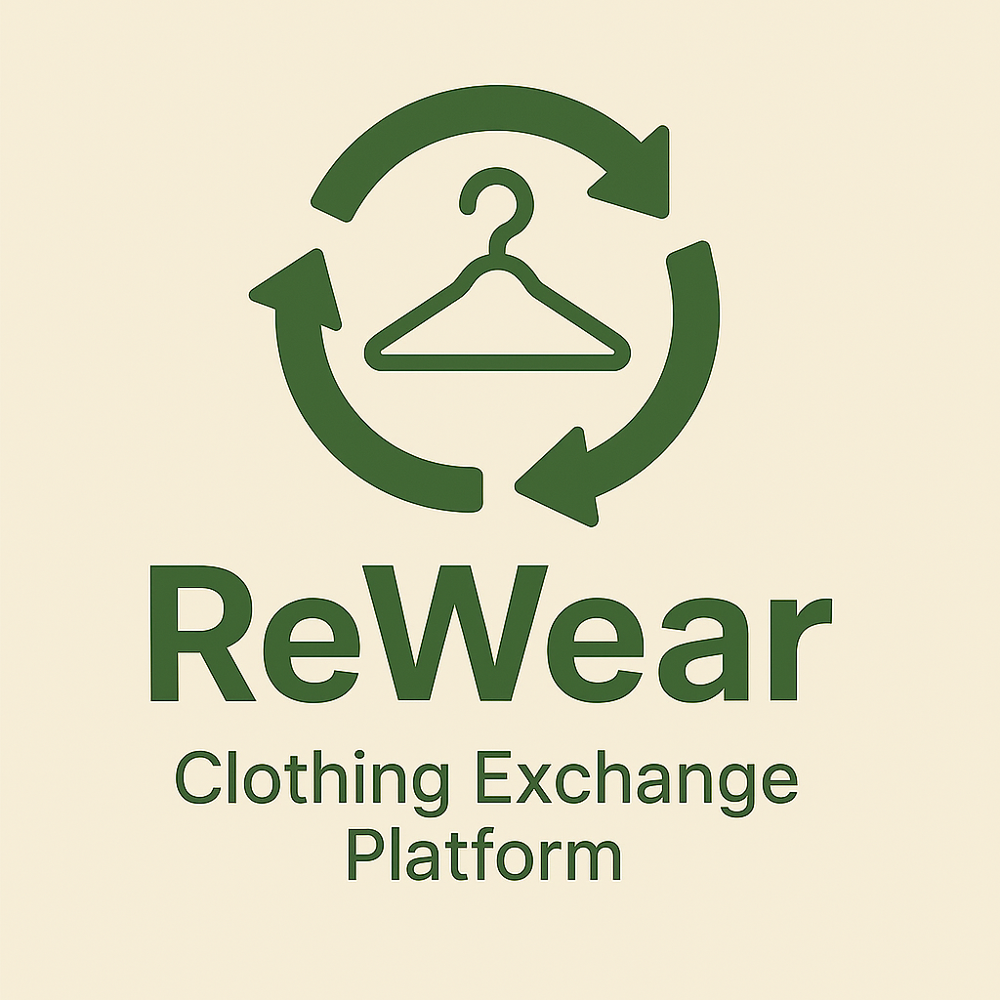

## Team Number : 4705
---
## Problem-statement : 3 ReWear Platform

---
## Team Members

Adarsh Shukla - adarsh270505@gmail.com
Daksh Mane - dakshmane2005@gmail.com
Ankit Kumawat - kumawatankit231@gmail.com

---

# 👚 ReWear – Community Clothing Exchange Platform

> A web-based platform that enables users to exchange unused clothing via direct swaps or a point-based system – encouraging sustainable fashion and reducing textile waste.

---

## 🌿 Overview

**ReWear** is an eco-conscious community platform that promotes the reuse of wearable garments. Users can either:

- 🤝 Swap clothes directly with others, or  
- 💎 Earn points by donating clothes and use them to redeem others' clothing

The goal is to reduce the growing problem of textile waste and support a culture of sustainable fashion by giving clothes a second life.

---

## 🎯 Key Features

- 👕 Upload and list unused clothes for exchange
- 🔄 Direct swap between users
- 💰 Point-based redemption system
- 📊 Leaderboard for eco-impact
- 🔔 Notifications for swap requests and confirmations
- 🔒 Secure login system (OAuth or custom)

---

## 💡 Problem Statement

> Millions of tons of textile waste end up in landfills every year. ReWear aims to tackle this by creating a **community-first reuse platform** that makes clothing exchange seamless, rewarding, and impactful.

---
#Link - [Visit](https://rewear-hack-k3xkz9dtt-dakshmanes-projects.vercel.app/)

